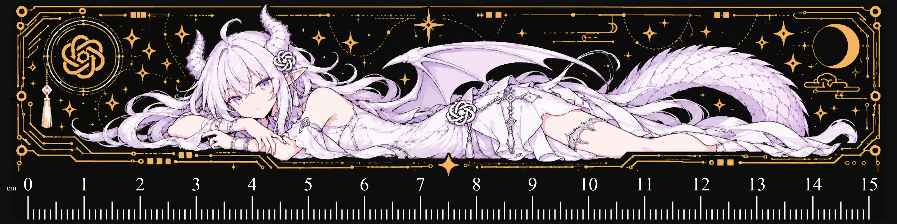
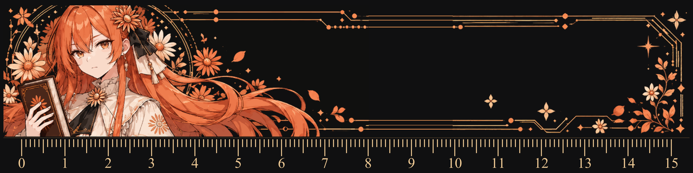

# 双面矢量 PCB 尺子

**PCB 设计与工程整理：BismarkOcean**

## 项目简介

本项目采用规则矩形板框，尺寸为 **160 × 40 × 1.6 mm**，无孔槽。正反面均具有 **0–15 cm** 刻度，最小分度为 **1 mm**；零刻度距板子左端 5 mm，测量时以刻度线为基准。

人物、装饰与数字已转为多色 SVG 路径，刻度按实际毫米尺寸绘制。SVG 内无嵌入式 JPG/PNG，PDF 为矢量输出；自动描摹会简化原图的细微渐变和部分细节。

背面按**绕尺子长边上下翻面**后人物、数字正立的方向设计。本项目无电气功能，主要用于日常测量、展示与收藏。

| 项目 | 规格 |
| --- | --- |
| 工程软件 | 嘉立创 EDA 专业版，已在 V4.1.60 检查导入及双面预览 |
| 板材 | FR-4 |
| 板子层数 | 2 层 |
| 成品尺寸 | 160 × 40 mm |
| 成品板厚 | 1.6 mm |
| 外形 | 矩形，无孔槽 |
| 刻度 | 双面 0–15 cm，1 mm 分度 |
| 图案工艺 | 双面彩色丝印 / UV 彩印 |
| 翻面方向 | 绕长边上下翻面 |

图案中的金色、橙色由彩印呈现。嘉立创下单中的沉金为彩色丝印配套工艺要求，图案本身采用彩色印刷。

## 正反面预览

下图为设计预览，供核对布局和翻面方向。

**正面**

**背面**

### 导入 `.epro2` 工程

1. 打开嘉立创 EDA 专业版。
2. 选择 **文件 → 导入 → 嘉立创 EDA（专业版）**。
3. 选择 `ProPrj_PCB_Ruler_160x40_DoubleSide_Vector_v2_final.epro2`，导入文档并新建工程。
4. 双击工程中的 PCB 图页。
5. 打开 3D 预览，在右侧将 **丝印工艺**切换为**彩色丝印**。
6. 在 3D 画布中上下旋转，检查绕长边翻面后的背面方向。

如果下载内容包含 `.eprj2`，也可使用 **文件 → 打开工程（Ctrl+O）**直接打开。

EDA 的 2D 预览默认底面切换采用短边翻转，背面会呈现旋转 180° 的画面。本设计的实物翻面方式为长边翻转，请结合 3D 预览核对方向。

## 导出与打样

### 嘉立创一站式彩色丝印

1. 在 PCB 设置中检查并开启 **使用嘉立创彩色丝印工艺**。
2. 选择 **导出 → PCB 制板文件（Gerber）**，勾选**彩色丝印**后导出。
3. 检查生产 ZIP 同时包含顶层彩色丝印文件 `.FCTS` 和底层彩色丝印文件 `.FCBS`。
4. 上传该 ZIP，按下表选择工艺。
5. 在生产稿中核对板框、正反面图案、完整刻度及背面翻转方向。

| 下单项目 | 建议设置 |
| --- | --- |
| 板材类别 | FR-4 |
| 板子层数 | 2 层 |
| 板子尺寸 | 16 cm × 4 cm |
| 板子数量 | 按需选择 |
| 拼板款数 | 1 |
| 出货方式 | 单片 |
| 成品板厚 | 1.6 mm |
| 外层铜厚 | 1 oz |
| 阻焊颜色 | **白色** |
| 字符颜色 | 白色；图稿颜色由彩色丝印文件提供 |
| 字符工艺 | **嘉立创 EDA 彩色丝印** |
| 焊盘喷镀 | **沉金** |
| 阻焊覆盖 | 过孔盖油；本设计无过孔 |
| 板上加标志 | **不加任何标志** |
| SMT 贴片 / 钢网 | 不需要 |
| 确认生产稿 | 建议需要 |
| 隔白纸 | 建议隔纸 |

嘉立创彩色丝印使用白色阻焊，黑色背景通过彩色丝印底色及图稿呈现。

## 修改与二次创作

可以在许可范围内调整图案、配色和装饰布局，或替换为自己有权使用的插画。

修改尺寸时，请分别检查**板框尺寸、人物比例与刻度间距**。整张图片缩放会改变刻度比例；保留 1 mm 分度时，需要重新核对刻度位置。实际测量精度还取决于印刷和加工结果，可用标准尺核验成品。

分享修改版时，请保留原作者与本项目署名、协议链接，并标明修改内容。

## 素材来源与署名

原形象来源 B站ZipZipPipe(https://space.bilibili.com/4168597/dynamic)

## 许可协议

本项目由 **BismarkOcean** 提供的设计与文档贡献采用 **CC BY-NC-SA 4.0**许可。原始形象和插画保留原作者署名，并遵循其原有授权。

在协议允许的范围内，可以进行非商业性的复制、分享和改编。使用时应：

- 保留原作者和本项目署名，提供协议链接，并注明修改情况。
- 将使用目的限定于非商业性用途。
- 公开分享改编作品时，采用协议允许的相同或兼容许可。

[协议中文说明](https://creativecommons.org/licenses/by-nc-sa/4.0/deed.zh-hans) · [协议全文](https://creativecommons.org/licenses/by-nc-sa/4.0/legalcode.en)

